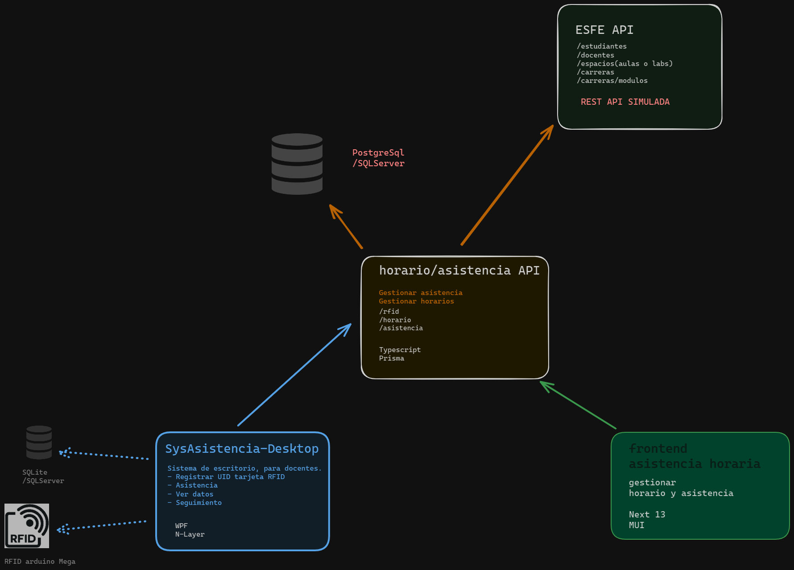

# Sistema de automatización de asistencia 

Este proyecto es parte de una solucion mas grande que consta de 4 proyectos
- App de Asistencia de Escritorio (Este proyecto)
- Api Asistencia y Horario
- Api de ESFE/Api simulada para el desarrollo
- Frontend Administrativo

## Tecnologías usadas

- Arquitectura N-Layer
- WPF .Net
- RestSharp 
- BD local SQLSERVER